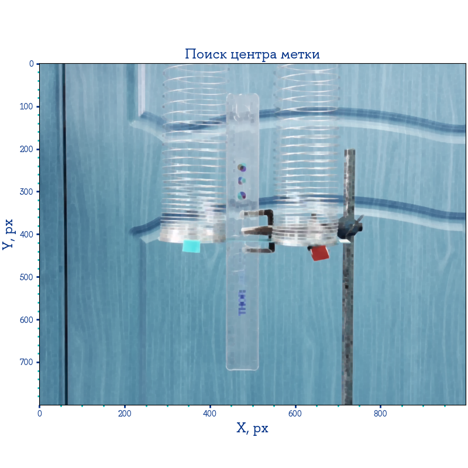
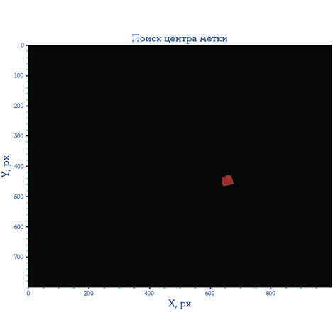

Модуль для нахождения центра цветных меток на видео с помощью CV-алгоритмов

Начальная картинка в GBR         | Выделенная метка
:-------------------------:|:-------------------------:
  |  

Полученные данные осцилляций метки сравниваются с теорией:

